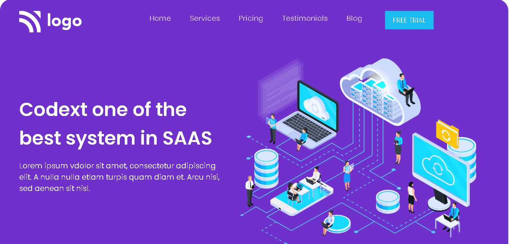

# Assignment-13

# Project [Deployed Link](https://deepakproject13.netlify.app)

- What I learned from this Project?
  - 
  - Learned how to make SAAS landing page.
  - Learned how to give border radius to webpage and giving background-color. 
  - Learned how to make different Testimonials.
  - Align item's using flex-box.
  - How to use different Google Fonts in webpage.
  - Learned how to make responsive web-design.
  
  

 
---

## Time taken to finish this project

- 6 hour to complete it.

---

## ScreenShot

